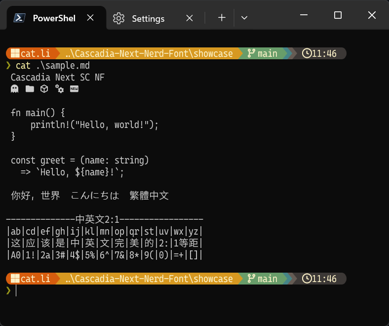

# Cascadia Next Nerd Font

**[简体中文](README.md)** · **[繁體中文](README.tc.md)** · **[English](README.en.md)** · **日本語**

[Cascadia Next](https://github.com/microsoft/cascadia-code/releases/tag/cascadia-next) に完全な [Nerd Fonts](https://www.nerdfonts.com/) アイコンセットをパッチしたフォント。簡体字中国語（SC）・繁体字中国語（TC）・日本語（JP）の3バリアントに対応しています。

## プレビュー


## バリアント

| フォント名           | 対象言語     | ウェイト数 |
| -------------------- | ------------ | ---------- |
| Cascadia Next SC NF  | 簡体字中国語 | 7          |
| Cascadia Next TC NF  | 繁体字中国語 | 7          |
| Cascadia Next JP NF  | 日本語       | 7          |

利用可能なウェイト：ExtraLight · Light · Regular · Medium · SemiBold · Bold · ExtraBold

---

## インストール

[Releases](https://github.com/LiLittleCat/Cascadia-Next-Nerd-Font/releases) ページから使用するバリアントのアーカイブをダウンロードしてください。

| ファイル                    | 内容                       |
| --------------------------- | -------------------------- |
| `CascadiaNextSCNF-ttf.zip`  | SC バリアント、個別 TTF    |
| `CascadiaNextSCNF-ttc.zip`  | SC バリアント、TTC コレクション |
| `CascadiaNextTCNF-ttf.zip`  | TC バリアント、個別 TTF    |
| `CascadiaNextJPNF-ttf.zip`  | JP バリアント、個別 TTF    |

`.tar.gz` 形式も同名で提供しています。

**macOS（推奨：Homebrew）**
```bash
brew tap LiLittleCat/tap

# 簡体字中国語
brew install --cask font-cascadia-next-sc-nerd-font
# 繁体字中国語
brew install --cask font-cascadia-next-tc-nerd-font
# 日本語
brew install --cask font-cascadia-next-jp-nerd-font
```

**macOS（手動）**
```bash
cp *.ttf ~/Library/Fonts/
```

**Linux**
```bash
mkdir -p ~/.local/share/fonts
cp *.ttf ~/.local/share/fonts/
fc-cache -fv
```

**Windows**：`.ttf` / `.ttc` を右クリック → **すべてのユーザーにインストール**

---

## 使い方

インストール後、ターミナルやエディターのフォントを `Cascadia Next JP NF`（または SC / TC）に設定してください。

**kitty**
```
font_family Cascadia Next JP NF
```

**Alacritty** (`alacritty.toml`)
```toml
[font.normal]
family = "Cascadia Next JP NF"
```

**VS Code** (`settings.json`)
```json
"editor.fontFamily": "'Cascadia Next JP NF', monospace"
```

**Windows Terminal** (`settings.json`)
```json
"font": { "face": "Cascadia Next JP NF" }
```

---

## アンインストール

**macOS（Homebrew）**
```bash
brew uninstall --cask font-cascadia-next-sc-nerd-font
brew uninstall --cask font-cascadia-next-tc-nerd-font
brew uninstall --cask font-cascadia-next-jp-nerd-font

brew untap LiLittleCat/tap
```

**macOS（手動）**
```bash
rm ~/Library/Fonts/CascadiaNext*NF-*.ttf
```

**Linux**
```bash
rm ~/.local/share/fonts/CascadiaNext*NF-*.ttf && fc-cache -fv
```

**Windows**：コントロールパネル → フォント → 対象フォントを右クリック → 削除

---

## ビルド方法

### 必要な環境

| 依存関係             | 説明                                                         |
| -------------------- | ------------------------------------------------------------ |
| Python ≥ 3.10        | ビルドスクリプトの実行に必要                                 |
| fontTools            | `pip install fonttools`                                      |
| FontForge + ffpython | `font-patcher` の実行に必要。`ffpython` が PATH に含まれること |
| font-patcher         | `FontPatcher/` ディレクトリまたはカレントディレクトリに配置  |

### 手順

**1. システム依存関係のインストール**

```bash
sudo apt update && sudo apt install -y fontforge python3-fontforge python3-fonttools
```

**2. リポジトリのクローン**

```bash
git clone https://github.com/LiLittleCat/Cascadia-Next-Nerd-Font.git
cd Cascadia-Next-Nerd-Font
```

**3. 元フォントのダウンロード**

[Cascadia Next リリースページ](https://github.com/microsoft/cascadia-code/releases/tag/cascadia-next) からアーカイブをダウンロードし、以下のファイルを `original/` に配置してください。

```
original/
├── CascadiaNextSC.wght.ttf
├── CascadiaNextTC.wght.ttf
└── CascadiaNextJP.wght.ttf
```

コマンドラインから直接ダウンロードする場合：

```bash
mkdir -p original
wget -O cascadia-next.zip https://github.com/microsoft/cascadia-code/releases/download/cascadia-next/CascadiaNext.zip
unzip cascadia-next.zip "*.wght.ttf" -d original
```

**4. font-patcher のダウンロード**

```bash
wget -q https://github.com/ryanoasis/nerd-fonts/raw/refs/heads/master/FontPatcher.zip
unzip FontPatcher.zip -d FontPatcher
```

**5. ビルドの実行**

```bash
# 3バリアントすべてをビルド（SC / TC / JP）
python script/build.py

# 特定のバリアントのみビルド
python script/build.py original/CascadiaNextJP.wght.ttf

# 特定のウェイトのみ生成
python script/build.py --weights 400 700
```

出力先は `dist/`。

### 出力ディレクトリ構造

```
dist/
├── CascadiaNextSC/
│   ├── ttf/          # ウェイトごとの個別 TTF ファイル
│   ├── ttc/          # 全ウェイトをまとめた TTC コレクション
│   └── archives/     # ttf・ttc の .zip および .tar.gz
├── CascadiaNextTC/
│   └── ...（同上）
└── CascadiaNextJP/
    └── ...（同上）
```

### コマンドラインオプション

```
usage: build.py [-h] [--weights N [N ...]] [--ffpython PATH]
                [--font-patcher PATH] [--out DIR] [--temp DIR]
                [fonts ...]

positional arguments:
  fonts                 処理する可変フォントファイル（省略時は original/ の SC/TC/JP）

options:
  --weights N [N ...]   生成するウェイト（デフォルト: 200 300 400 500 600 700 800）
  --ffpython PATH       ffpython のフルパス（省略時は PATH から自動検出）
  --font-patcher PATH   font-patcher のパス（省略時は FontPatcher/ を検索）
  --out DIR             出力ルートディレクトリ（デフォルト: dist）
  --temp DIR            一時作業ディレクトリ（デフォルト: .build_temp）
```

### ビルドのしくみ

1. **インスタンス化**：`fontTools.varLib.instancer` を使用して可変フォント（`.wght.ttf`）を各ウェイトの静的 TTF に分割する。
2. **パッチ適用**：短い一時名（例: `CNextJPNF`）で `font-patcher --complete` を呼び出し、Nerd Fonts アイコンセットを埋め込む（内部名称の 63 文字制限を回避するため）。
3. **名前の書き換え**：`fontTools` で name テーブル（nameID 1/2/4/6/16/17）を上書きし、正しいファミリー名と PostScript 名を設定する。
4. **パッケージング**：全ウェイトを TTC にまとめ、`.zip` と `.tar.gz` アーカイブを生成する。

---

## ライセンス

本プロジェクトは2つのライセンスを使用しています。

| 対象                       | ライセンス                                        |
| -------------------------- | ------------------------------------------------- |
| ビルドスクリプト（`script/`） | [MIT License](LICENSE)                         |
| 出力フォントファイル        | [SIL Open Font License 1.1](LICENSE-OFL)          |

フォントファイルは [Cascadia Next](https://github.com/microsoft/cascadia-code/releases/tag/cascadia-next)（© Microsoft Corporation、SIL OFL 1.1）を元に、[Nerd Fonts](https://github.com/ryanoasis/nerd-fonts) のアイコン（SIL OFL 1.1）を埋め込んだ派生物です。
