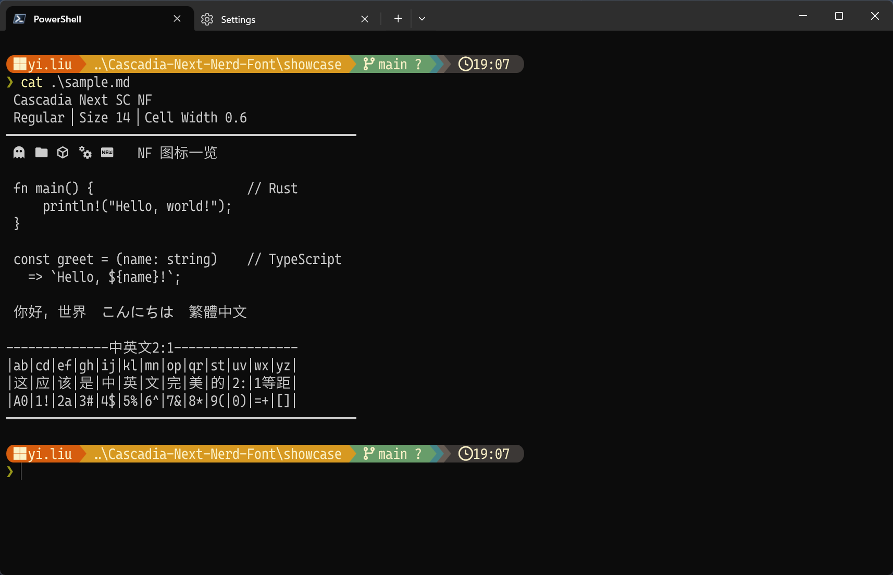

# Cascadia Next Nerd Font

**简体中文** · **[繁體中文](README.tc.md)** · **[English](README.en.md)** · **[日本語](README.ja.md)**

为 [Cascadia Next](https://github.com/microsoft/cascadia-code/releases/tag/cascadia-next) 字体打上完整 [Nerd Fonts](https://www.nerdfonts.com/) 补丁，同时支持简中（SC）、繁中（TC）、日文（JP）三个中日文变体。

## 预览



## 字体变体

| 字体族名称          | 适用场景 | 字重数量 |
| ------------------- | -------- | -------- |
| Cascadia Next SC NF | 简体中文 | 7        |
| Cascadia Next TC NF | 繁体中文 | 7        |
| Cascadia Next JP NF | 日文     | 7        |

可用字重：ExtraLight · Light · Regular · Medium · SemiBold · Bold · ExtraBold

---

## 安装

前往 [Releases](https://github.com/LiLittleCat/Cascadia-Next-Nerd-Font/releases) 页面，下载对应变体的压缩包：

| 文件                        | 内容                   |
| --------------------------- | ---------------------- |
| `CascadiaNextSCNF-ttf.zip`  | SC 变体，单个 TTF 文件 |
| `CascadiaNextSCNF-ttc.zip`  | SC 变体，TTC 合集      |
| `CascadiaNextTCNF-ttf.zip`  | TC 变体，单个 TTF 文件 |
| `CascadiaNextJPNF-ttf.zip`  | JP 变体，单个 TTF 文件 |

解压后按系统安装：

**macOS**
```bash
cp *.ttf ~/Library/Fonts/
```

**Linux**
```bash
mkdir -p ~/.local/share/fonts
cp *.ttf ~/.local/share/fonts/
fc-cache -fv
```

**Windows**：右键 `.ttf` / `.ttc` 文件 → **为所有用户安装**

---

## 使用

安装完成后，在终端或编辑器中将字体设置为 `Cascadia Next SC NF`（或 TC / JP 变体）。

**kitty**
```
font_family Cascadia Next SC NF
```

**Alacritty** (`alacritty.toml`)
```toml
[font.normal]
family = "Cascadia Next SC NF"
```

**VS Code** (`settings.json`)
```json
"editor.fontFamily": "'Cascadia Next SC NF', monospace"
```

**Windows Terminal** (`settings.json`)
```json
"font": { "face": "Cascadia Next SC NF" }
```

---

## 自行构建

### 前置依赖

| 依赖                 | 说明                                                     |
| -------------------- | -------------------------------------------------------- |
| Python ≥ 3.10        | 运行构建脚本                                             |
| fontTools            | `pip install fonttools`                                  |
| FontForge + ffpython | 用于执行 `font-patcher`；需要 `ffpython` 在 PATH 中     |
| font-patcher         | Nerd Fonts 补丁工具，放在 `FontPatcher/` 目录或当前目录 |

### 步骤

**1. 安装系统依赖**

```bash
sudo apt update && sudo apt install -y fontforge python3-fontforge python3-fonttools
```

**2. 克隆仓库**

```bash
git clone https://github.com/LiLittleCat/Cascadia-Next-Nerd-Font.git
cd Cascadia-Next-Nerd-Font
```

**3. 下载原始字体**

前往 [Cascadia Next 发布页](https://github.com/microsoft/cascadia-code/releases/tag/cascadia-next) 下载压缩包，解压后将以下文件放入 `original/`：

```
original/
├── CascadiaNextSC.wght.ttf
├── CascadiaNextTC.wght.ttf
└── CascadiaNextJP.wght.ttf
```

或直接用命令行（版本号请按实际修改）：

```bash
mkdir -p original
wget -O cascadia-next.zip https://github.com/microsoft/cascadia-code/releases/download/cascadia-next/CascadiaNext.zip
unzip cascadia-next.zip "*.wght.ttf" -d original
```

**4. 下载 font-patcher**

```bash
wget -q https://github.com/ryanoasis/nerd-fonts/raw/refs/heads/master/FontPatcher.zip
unzip FontPatcher.zip -d FontPatcher
```

**5. 运行构建**

```bash
# 构建全部三个变体（SC / TC / JP）
python script/build.py

# 只构建某一个变体
python script/build.py original/CascadiaNextSC.wght.ttf

# 只生成指定字重
python script/build.py --weights 400 700
```

产物输出到 `dist/`。

### 输出目录结构

```
dist/
├── CascadiaNextSC/
│   ├── ttf/          # 单个 TTF 文件（每个字重一个）
│   ├── ttc/          # 所有字重合并的 TTC 集合
│   └── archives/     # ttf / ttc 的 .zip 和 .tar.gz 打包
├── CascadiaNextTC/
│   └── ...（同上）
└── CascadiaNextJP/
    └── ...（同上）
```

### 命令行参数

```
usage: build.py [-h] [--weights N [N ...]] [--ffpython PATH]
                [--font-patcher PATH] [--out DIR] [--temp DIR]
                [fonts ...]

positional arguments:
  fonts                 要处理的变量字体文件（默认处理 original/ 下的 SC/TC/JP）

options:
  --weights N [N ...]   要生成的字重，默认: 200 300 400 500 600 700 800
  --ffpython PATH       ffpython 完整路径；省略则从 PATH 自动查找
  --font-patcher PATH   font-patcher 路径；省略则在 FontPatcher/ 或当前目录查找
  --out DIR             输出根目录，默认: dist
  --temp DIR            临时工作目录，默认: .build_temp
```

### 构建流程说明

1. **实例化**：用 `fontTools.varLib.instancer` 将可变字体（`.wght.ttf`）按目标字重切分为静态 TTF。
2. **打补丁**：以临时短名（如 `CNextSCNF`）调用 `font-patcher --complete`，嵌入全套 Nerd Fonts 图标，避免内部名称超过 63 字符限制。
3. **重命名**：用 `fontTools` 覆写 name 表（nameID 1/2/4/6/16/17），写入正确的最终字体族名称和 PostScript 名称。
4. **打包**：将所有字重合并为 TTC，并分别生成 `.zip` 与 `.tar.gz` 归档。

---

## 许可证

本项目包含两个许可证：

| 内容                   | 许可证                                             |
| ---------------------- | -------------------------------------------------- |
| 构建脚本（`script/`）  | [MIT License](LICENSE)                             |
| 输出字体文件           | [SIL Open Font License 1.1](LICENSE-OFL)           |

字体文件派生自 [Cascadia Next](https://github.com/microsoft/cascadia-code/releases/tag/cascadia-next)（© Microsoft Corporation，SIL OFL 1.1），并嵌入了 [Nerd Fonts](https://github.com/ryanoasis/nerd-fonts) 图标（SIL OFL 1.1）。
